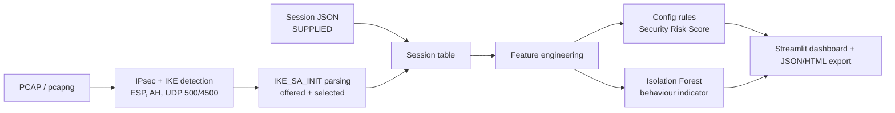

# 🔐 IPsec VPN Analyzer — SIH26160 (NTRO) · Team SYNTRIX DACE

**SYNTHETIC / DEFENSIVE PROTOTYPE.** Findings are *indicators requiring validation*. The tool does **not** decrypt IPsec,
recover keys, bypass a VPN, identify hidden users, infer a cipher from ESP ciphertext, or prove a compromise.

## Problem Statement
SIH26160: *AI-Powered IPsec VPN Protocol Analyzer and Security Assessment Framework* (NTRO).

## Problem
IPsec tunnels are encrypted, so analysts cannot see how they are configured. Weak or legacy settings (3DES, MD5, SHA-1,
DH group 1/2, IKEv1 Aggressive Mode) are easy to miss, and the only cleartext evidence is the IKE handshake.

## Proposed Solution
Read the cleartext IKE handshake from a capture, score the configuration with transparent rules, and show a separate
machine-learning behaviour indicator. **Our differentiator:** we compare what the initiator **offered** with what the
responder **selected** (`OFFER-WEAK`, `RESP-WEAKER`), not only the final suite.

## Architecture


## Evidence tiers
`OBSERVED` read from cleartext IKE in a capture · `SUPPLIED` from user JSON, unverified · `ADVISORY` best-practice note.
The ML result is labelled a behaviour indicator and is **never** added to the Security Risk Score.

## Features
- PCAP/pcapng streaming parser (Scapy): Ethernet/cooked/VLAN, IPv4/IPv6, ESP, AH, IKE UDP/500, NAT-T UDP/4500.
- IKEv2 IKE_SA_INIT: all offered proposals + the selected one. IKEv1 and Aggressive Mode detected (header only).
- 12 rules with explicit points; per-session breakdown, remediation text, JSON and HTML export.
- Isolation Forest behaviour indicator (separate), "insufficient data" when a session has under 20 packets.
- Unknown fields are reported as **NOT ASSESSED**, never silently treated as safe.
- "Why this ML score?" panel compares a session with the synthetic baseline (packets, bytes, duration, rates).
- 4-page dark dashboard: Command Center, Packet Analysis, Risk Explanation, Timeline.

## Technology Stack
Python 3.10+, Streamlit, Pandas, NumPy, scikit-learn, Scapy, Plotly, Pytest. Fully offline; no APIs.

## Installation
**Windows (PowerShell)**
```powershell
python -m venv .venv
.venv\Scripts\activate
python -m pip install -r requirements.txt
streamlit run app.py
```
**Linux / macOS**
```bash
python3 -m venv .venv && source .venv/bin/activate
python -m pip install -r requirements.txt
streamlit run app.py
```

## 2-minute judge demo
1. `streamlit run app.py` (default input is the demo capture with 8 synthetic sessions).
2. **Command Center:** the legacy 3DES session is HIGH; the MD5 + DH-1536 session is MEDIUM; the volume session shows an ML anomaly.
3. **Risk Explanation:** pick `10.0.2.2` and show the offered-vs-selected table and point breakdown.
4. **Packet Analysis:** read the warning that ESP does not reveal the cipher.
5. **Timeline:** IKE events over packet volume. Then try **Upload session JSON** with `sample/sample_sessions.json`.

## Methodology
**Risk:** deterministic rules (`src/risk_engine.py`), bands LOW 0-24, MEDIUM 25-49, HIGH 50-74, CRITICAL 75-100, capped at 100.
Points: IKEv1 20, Aggressive 15, DES 30, 3DES 18, MD5 20, SHA-1 12, DH 1/2 20, DH 5 12, OFFER-WEAK 8, RESP-WEAKER 8;
PSK and no-post-quantum are notes with 0 points. AES, SHA-2 and AEAD are not flagged.
**ML:** Isolation Forest (RobustScaler, 200 trees, `random_state=42`) trained on a deterministic *synthetic* baseline of
normal sessions; features: packets, bytes, duration, packets/s, mean packet size. See `docs/methodology.md`.

## Results (from a real run on synthetic lab captures)
`pytest -q`: **34 passed** (golden captures, risk rules, VLAN / Linux-cooked / IPv6 / NAT-T / pcapng captures, fuzzing of malformed IKE and capture files, and a Streamlit smoke test of every input mode). The dashboard was also driven in headless Chromium: all 4 tabs, all 8 demo sessions, PCAP/JSON upload, a garbage-file upload, and both report downloads, with no errors. Golden captures (`sample/*.pcap` vs `sample/expected_findings.json`):

| Scenario | Score | Level | Findings (all OBSERVED except NO-PQ) | ML anomaly |
|---|---|---|---|---|
| strong | 0 | LOW | NO-PQ | no |
| legacy_3des | 58 | HIGH | ENC-3DES, HASH-SHA1, DH-WEAK, RESP-WEAKER, NO-PQ | no |
| offer_weak | 8 | LOW | OFFER-WEAK, NO-PQ | no |
| resp_weaker | 8 | LOW | RESP-WEAKER, NO-PQ | no |
| md5_dh5 | 32 | MEDIUM | HASH-MD5, DH-LOW, NO-PQ | no |
| pq_hybrid | 0 | LOW | none | no |
| ikev1_aggressive | 35 | MEDIUM | IKEV1, AGGR-MODE | n/a (1 packet) |
| volume_anomaly | 0 | LOW | NO-PQ | **yes** |

ML self-test on synthetic data (500 normal, 50 injected outliers): detection rate 1.00, false-positive rate 0.032.
These numbers come from synthetic data we generated. They show the code behaves as designed, **not** real-world accuracy.

## PS compliance matrix (verify against the official PS text)
| Requirement | Status |
|---|---|
| Capture analysis of IKE / ESP / AH | Done |
| Identify IKE version and mode | Partial (IKEv2 full; IKEv1 header and Aggressive Mode only) |
| Identify cipher / integrity / DH from handshake | Done for IKEv2 (cleartext SA_INIT) |
| Security assessment of configuration | Done |
| AI component | Partial (anomaly indicator vs a synthetic baseline) |
| Threat matrix | Not done |
| VPN testbed generation (strongSwan, Docker) | Not done (synthetic capture generator only) |
| Demonstration video | Not done (record from the dashboard) |

## Technical limitations
IKEv2-focused; IKEv1 SA contents not parsed; no decryption; ESP flows are linked to a session by endpoint pair
(heuristic); authentication method is encrypted so it is `unknown` for captures; the ML baseline is synthetic;
all included captures are synthetic and carry no real-world accuracy claim.

## Security and ethical boundary
Use only on captures you are authorised to analyse. Uploaded files are parsed with bounds checks, a size cap (default 50 MB),
and no pickle/eval. Findings need human validation.

## Testing
```bash
python -m pytest -q
python scripts/make_lab_captures.py   # regenerates sample/ and data/
```

## Future scope
IKEv1 transform parsing, real public captures with provenance, strongSwan testbed, threat matrix, live capture.
